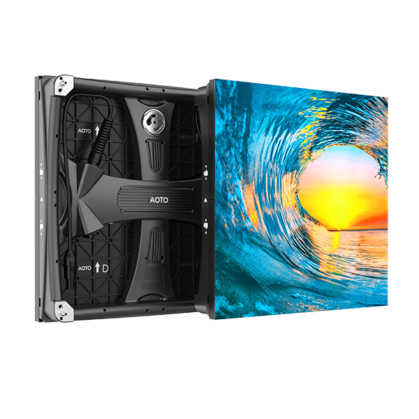

# AOTO AE Display Panel

> Links: [AE Product Page](https://en.aoto.com/products/wwwaotocomproductae-series.html)

## Panel Specs

| Name    | Cabinet Resolution | Pixel Pitch | Cabinet Size (Width x Height x Depth) | Refresh Rate | Brightness | Average Power |
|---------|--------------------|-------------|---------------------------------------|--------------|------------|---------------|
| AE1.5E  | 320 x 320 px       | 1.56 mm     | 500 mm x 500 mm x 88.2 mm             | 7680 Hz      | 1500 nits  | 50 Watts      |
| AE2.3   | 216 x 216 px       | 2.31 mm     | 500 mm x 500 mm x 88.2 mm             | 7680 Hz      | 1500 nits  | 50 Watts      |
