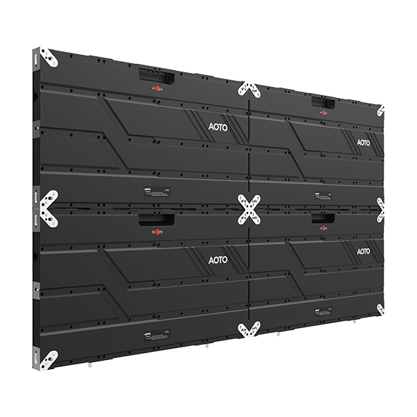

# AOTO CV Display Panel

> Links: [CV Product Page](https://en.aoto.com/products/cv-series.html)

## Panel Specs

| Name    | Cabinet Resolution | Pixel Pitch | Refresh Rate | Brightness | Average Power |
|---------|--------------------|-------------|--------------|------------|---------------|
| CVE0.9  | 640 x 360 px       | 0.9375 mm   | 3840 Hz      | 1000 nits  | 45 Watts      |
| CVE1.2  | 480 x 270 px       | 1.25 mm     | 3840 Hz      | 1000 nits  | 30 Watts      |
| CVE1.5  | 384 x 218 px       | 1.5625 mm   | 3840 Hz      |  800 nits  | 35 Watts      |
| CVE1.8  | 320 x 180 px       | 1.875 mm    | 4000 Hz      | 1000 nits  | 35 Watts      |
| CVE2.5  | 240 x 135 px       | 2.5 mm      | 3840 Hz      | 1000 nits  | 40 Watts      |

*Note: Cabinet size information not listed on product page*