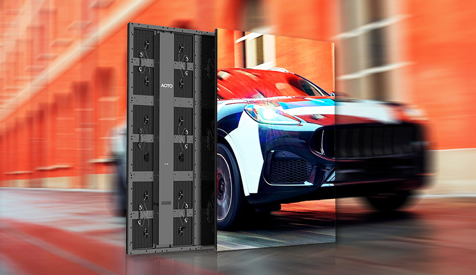

# AOTO EXLF Display Panel

> Links: [EXLF Product Page](https://en.aoto.com/products/exlf-series.html)

## Panel Specs

| Name    | Cabinet Resolution | Pixel Pitch | Cabinet Size (Width x Height x Depth) | Refresh Rate | Brightness | Average Power |
|---------|--------------------|-------------|---------------------------------------|--------------|------------|---------------|
| E4LF    | 288 x 432 px       | 4 mm        | 1152 mm x 1728 mm x 82 mm             | 3840 Hz      | 5500 nits  | 360 Watts     |
| E5LF    | 288 x 432 px       | 5.14 mm     | 1152 mm x 1728 mm x 82 mm             | 3840 Hz      | 5500 nits  | 360 Watts     |
| E6LF    | 288 x 432 px       | 6 mm        | 1152 mm x 1728 mm x 82 mm             | 3840 Hz      | 5500 nits  | 360 Watts     |

