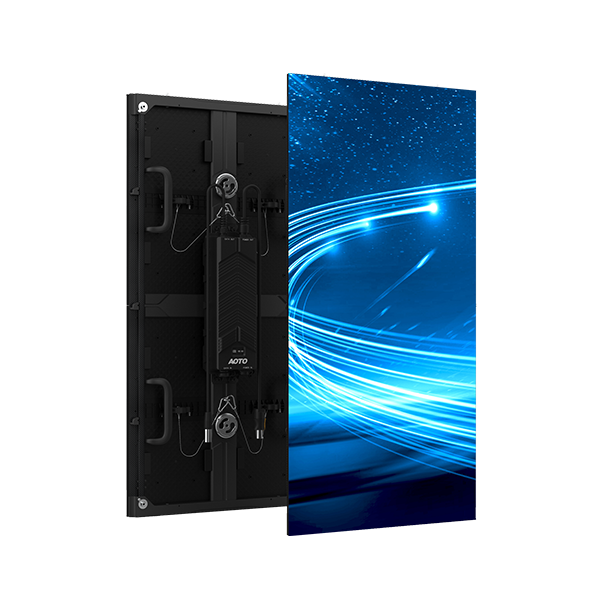

# AOTO MXH Display Panel

> Links: [MXH Product Page](https://en.aoto.com/products/mxh-series.html)

## Panel Specs

| Name    | Cabinet Resolution | Pixel Pitch | Cabinet Size (Width x Height x Depth) | Refresh Rate | Brightness | Average Power |
|---------|--------------------|-------------|---------------------------------------|--------------|------------|---------------|
| M3.7H   | 128 x 256 px       | 3.75 mm     | 480 mm x 960 mm x 92 mm               | 7680 Hz      | 5000 nits  | 97 Watts      |
| M5.8H   |  82 x 164 px       | 5.85 mm     | 480 mm x 960 mm x 92 mm               | 7680 Hz      | 6000 nits  | 90 Watts      |
