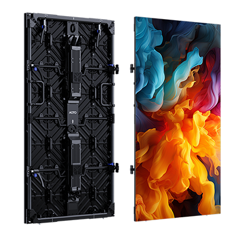

# AOTO SW Display Panel

> Links: [SW Product Page](https://en.aoto.com/products/swrgbw.html)

## Panel Specs

| Name    | Cabinet Resolution | Pixel Pitch | Cabinet Size (Width x Height x Depth) | Refresh Rate | Brightness | Average Power |
|---------|--------------------|-------------|---------------------------------------|--------------|------------|---------------|
| SW5.7C  | 288 x 432 px       | 5.76 mm     | 600 mm x 1200 mm x 90 mm              | 7680 Hz      | 600 nits   | 103 Watts     |

