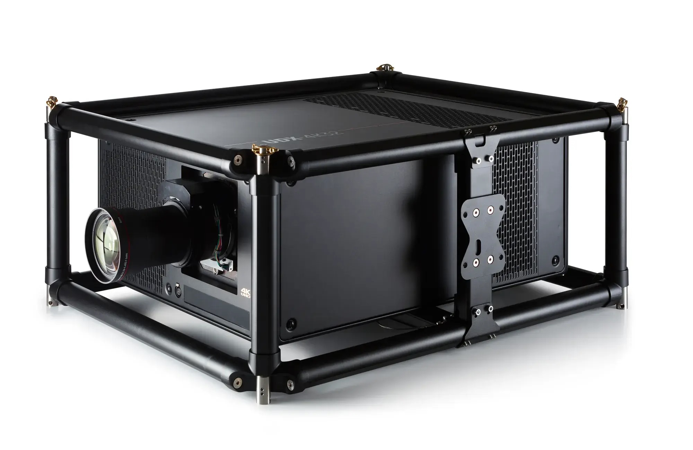

# Barco DLP Laser Projector

> Links: [Barco UDX-U45LC Product Page](https://www.barco.com/en/product/udx-u45lc) | [Spec Sheet PDF Guide](https://assets.barco.com/m/2a75d778f87718fb/original/UDX-U45LC-en-Spec-sheet.pdf) | [Projection Homepage](https://www.barco.com/en/products/projection)  
> Links: [Barco UDX-W40 Flex Product Page](https://www.barco.com/en/product/udx-w40) | [Spec Sheet PDF Guide](https://assets.barco.com/m/58ad5f096b4a886c/original/UDX-W40-FLEX-en-Spec-sheet.pdf) | [Projection Homepage](https://www.barco.com/en/products/projection)  
> Links: [Barco UDX-4K32 Flex Product Page](https://www.barco.com/en/product/udx-4k32) | [Spec Sheet PDF Guide](https://assets.barco.com/m/68e96a3b1d09716e/original/UDX-4K32-en-Spec-sheet.pdf) | [Projection Homepage](https://www.barco.com/en/products/projection)  

## Projector Specs

| Name              | Projector Resolution | DLP                     | Stereo 3D   | Cabinet Size (Width x Height x Depth) | Noise Level   | Brightness      | Contrast Ratio     | Average Power      | Mass    |
|-------------------|-----------------  ---|-------------------------|-------------|---------------------------------------|---------------|-----------------|--------------------|--------------------|---------|
| UDX-U45LC         | 1600 x 1200 px       |  3-Chip DLP RGB Laser   | Yes         | 660 mm x 830 mm x 350 mm              |  50 dB (A)    | 45000 Lumens    | 2200:1             | 3.75 KW @ 200-240V | 92 kg   |
| UDX-W40 FLEX      | 1920 x 1200 px       |  3-Chip DLP RGB Laser   | Yes         | 660 mm x 830 mm x 350 mm              |  58 dB (A)    | 40000 Lumens    | 2200:1             | 3.75 KW @ 200-240V | 92 kg   |
| UDX-4K32          | 3840 x 2400 px       |  3-Chip DLP RGB Laser   | Yes         | 660 mm x 830 mm x 350 mm              |  52 dB (A)    | 31000 Lumens    | 2200:1             | 3.75 KW @ 200-240V | 92 kg   |
