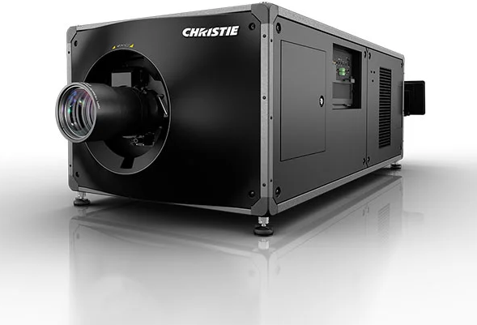

# Christie CineLife CP4455-RGB DLP Laser Projector

> Links: [Christie CineLife Product Page](https://www.christiedigital.com/products/cinema/projection/cinelife-plus-series/cp4455-rgb/) | [Spec Sheet PDF Guide](https://www.christiedigital.com/globalassets/resources/public/cp4455-rgb-datasheet.pdf) | [Projection Homepage](https://www.christiedigital.com/products/cinema/projection/cinelife-series/)

## Projector Specs

| Name              | Projector Resolution | DLP                     | Stereo 3D   | Cabinet Size (Width x Height x Depth) | Noise Level   | Brightness      | Contrast Ratio     | Average Power      | Mass    |
|-------------------|-----------------  ---|-------------------------|-------------|---------------------------------------|---------------|-----------------|--------------------|--------------------|---------|
| CP4455-RGB        | 4096 x 2160 px       |  3-Chip DLP RGB Laser   | Yes         | 1551 mm x 710 mm x 559 mm             |  70 dB (A)    | 57000 Lumens    | 6000:1             | 4.63 KW @ 200-240V | 167 kg  |
