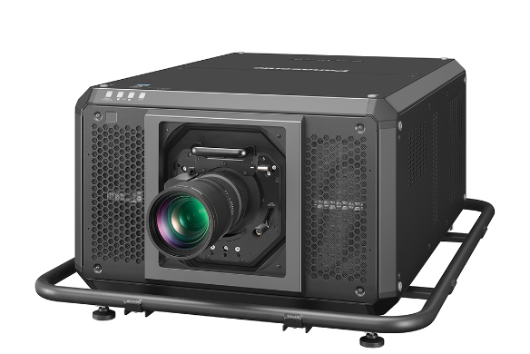

# Panasonic PT-RQ50KU DLP Laser Projector

> Links: [Panasonic Product Page](https://connect.na.panasonic.com/av/projectors/large-venue/pt-rq50k-native-4k-3-chip-dlp-projector) | [Spec Sheet PDF Guide](https://pna-b2b-storage-mkt.s3.amazonaws.com/production/300801_PT_RQ50K_2P_ctlg_Eng_PC.pdf?hsLang=en) | [YouTube Channel](https://www.youtube.com/user/PanasonicProjector) | [Projection Homepage](https://connect.na.panasonic.com/av/projectors)

## Projector Specs

| Name              | Projector Resolution | DLP                     | Stereo 3D   | Cabinet Size (Width x Height x Depth) | Noise Level   | Brightness      | Contrast Ratio     | Average Power      | Mass    |
|-------------------|-----------------  ---|-------------------------|-------------|---------------------------------------|---------------|-----------------|--------------------|--------------------|---------|
| PT-RQ50KU         | 4096 x 2160 px       |  3-Chip DLP RGB Laser   | No          | 720 mm x 445 mm x 1070 mm             |  52 dB        | 50000 Lumens    | 20000:1            | 4.1 KW @ 100-120V  | 126 kg  |
