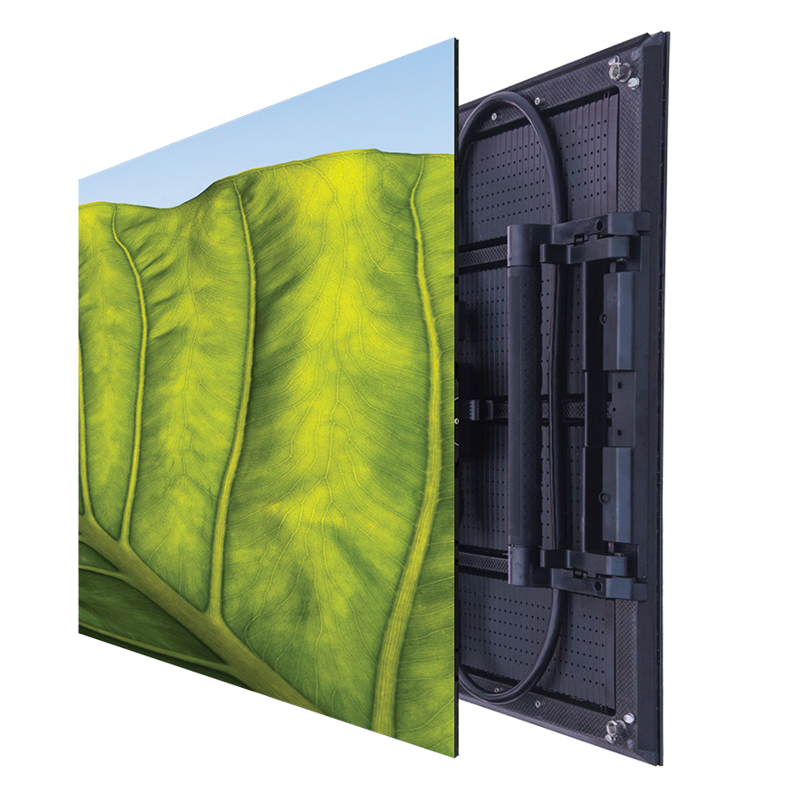

# Planar CarbonLight CLI Display Panel

> Links: [CarbonLight CLI Product Page](https://www.planar.com/products/led-video-walls/carbonlight/cli/) | [PDF Guide](https://www.planar.com/products/led-video-walls/carbonlight/cli/cli-specifications/planar-carbonlight-cli15/?f=Planar%20CarbonLight%20CLI1.5.pdf)

## Panel Specs

| Name         | Cabinet Resolution | Pixel Pitch | Cabinet Size (Width x Height x Depth) | Refresh Rate | Brightness | Average Power |
|--------------|--------------------|-------------|---------------------------------------|--------------|------------|---------------|
| CLI1.5       | 320 x 320 px       | 1.5 mm      | 500 mm x 500 mm x 63 mm               | 3840 Hz      |  600 nits  |  75 Watts     |
| CLI1.9-F     | 256 x 256 px       | 1.9 mm      | 500 mm x 500 mm x 53 mm               | 3840 Hz      |  600 nits  | 150 Watts     |
| CLI2.6-F     | 192 x 192 px       | 2.6 mm      | 500 mm x 500 mm x 53 mm               | 3840 Hz      | 1000 nits  | 150 Watts     |
| CLI3.9-F     | 128 x 128 px       | 3.9 mm      | 500 mm x 500 mm x 53 mm               | 3840 Hz      | 1000 nits  |  75 Watts     |
| CLI5.2-F     |  96 x  96 px       | 5.2 mm      | 500 mm x 500 mm x 53 mm               | 3840 Hz      | 1000 nits  |  75 Watts     |
