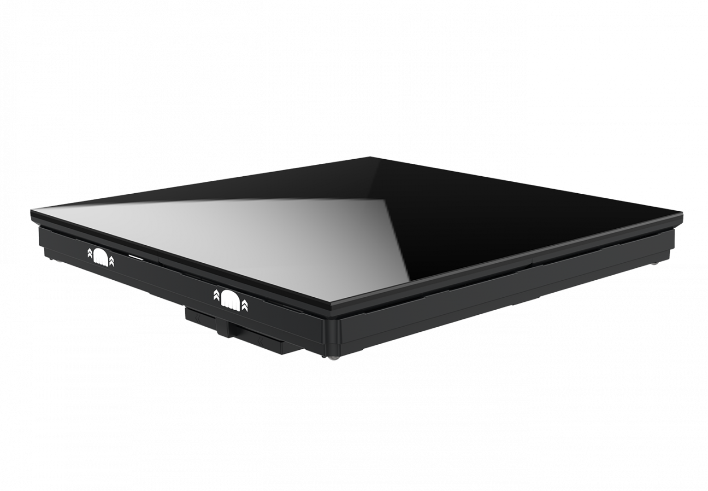

# Roe Visual Black Marble BM4 Display Panel

> Links: [Black Marble Product Page](https://www.roevisual.com/en/products/black-marble-bm4)

## Panel Specs

| Name         | Cabinet Resolution | Pixel Pitch | Cabinet Size (Width x Height x Depth) | Refresh Rate | Brightness | Average Power |
|--------------|--------------------|-------------|---------------------------------------|--------------|------------|---------------|
| BM2-Matte    | 216 x 216 px       | 2.82 mm     | 609.6 mm x 609.6 mm x 133 mm          | 7680 Hz      | 2000 nits  | 155 Watts     |
| B4-Glass     | 128 x 128 px       | 4.76 mm     | 609.6 mm x 609.6 mm x 142 mm          | 3840 Hz      |  800 nits  | 145 Watts     |
| B4-Matte     | 128 x 128 px       | 4.76 mm     | 609.6 mm x 609.6 mm x 135 mm          | 3840 Hz      | 2000 nits  | 145 Watts     |
| B4-Mirror    | 128 x 128 px       | 4.76 mm     | 609.6 mm x 609.6 mm x 142 mm          | 3840 Hz      | 1200 nits  | 145 Watts     |
