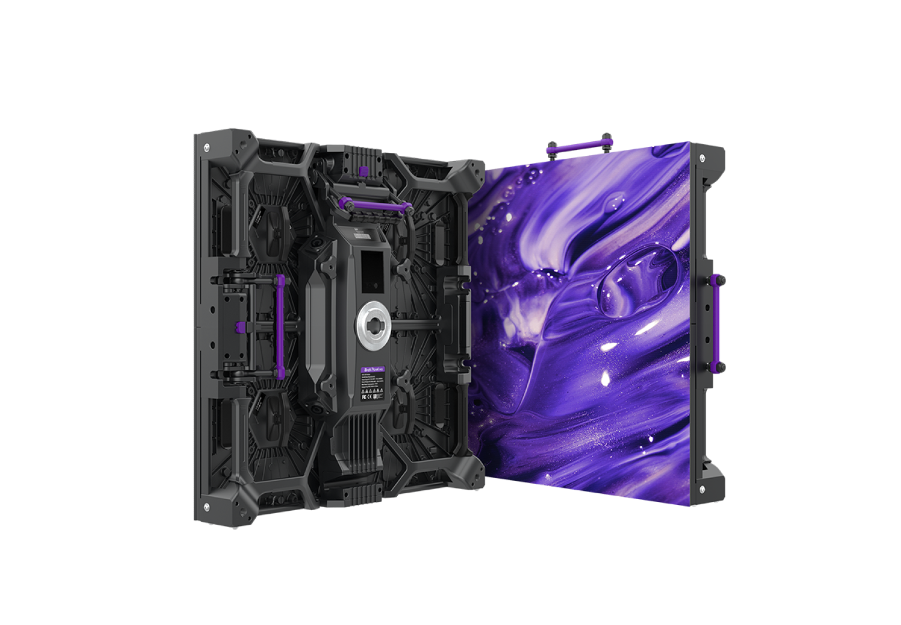

# Roe Visual Black Pearl 2V2 Display Panel

> Links: [Black Pearl 2V2 Product Page](https://www.roevisual.com/en/products/black-pearl-2v2)

## Panel Specs

| Name    | Cabinet Resolution | Pixel Pitch | Cabinet Size (Width x Height x Depth) | Refresh Rate | Brightness | Average Power |
|---------|--------------------|-------------|---------------------------------------|--------------|------------|---------------|
| BP2V2   | 176 x 176 px       | 2.84 mm     | 500 mm x 500 mm x 90 mm               | 7680 Hz      | 1500 nits  | 95 Watts      |

