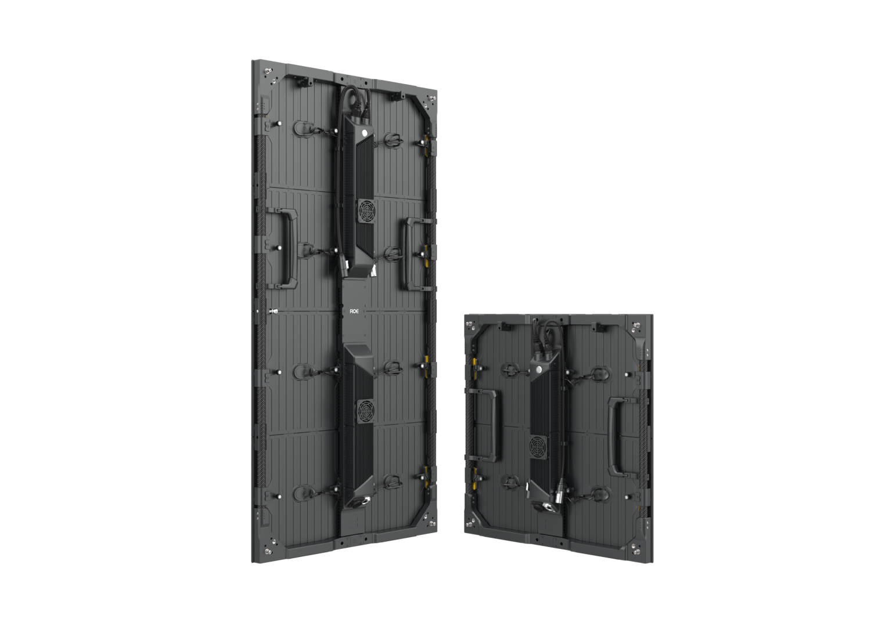

# Roe Visual Carbon Mark II Display Panel

> Links: [Obsidian Product Page](https://www.roevisual.com/en/products/cb-mark2)

## Panel Specs

| Name         | Cabinet Resolution | Pixel Pitch | Cabinet Size (Width x Height x Depth) | Refresh Rate | Brightness | Average Power |
|--------------|--------------------|-------------|---------------------------------------|--------------|------------|---------------|
| CB3MKII      | 160 x 320 px       | 3.75 mm     | 600 mm x 1200 mm x 79 mm              | 3840 Hz      | 4500 nits  | 300 Watts     |
| CB3MKII Half | 160 x 160 px       | 3.75 mm     | 600 mm x 600 mm x 79 mm               | 3840 Hz      | 4500 nits  | 145 Watts     |
| CB5MKII      | 104 x 208 px       | 5.77 mm     | 600 mm x 1200 mm x 79 mm              | 7680 Hz      | 6000 nits  | 240 Watts     |
| CB5MKII Half | 104 x 104 px       | 5.77 mm     | 600 mm x 600 mm x 79 mm               | 7680 Hz      | 6000 nits  | 125 Watts     |
| CB8MKII      |  72 x 144 px       | 8.33 mm     | 600 mm x 1200 mm x 79 mm              | 7680 Hz      | 6000 nits  | 260 Watts     |
| CB8MKII Half |   72 x 72 px       | 8.33 mm     | 600 mm x 600 mm x 79 mm               | 7680 Hz      | 6000 nits  | 130 Watts     |

