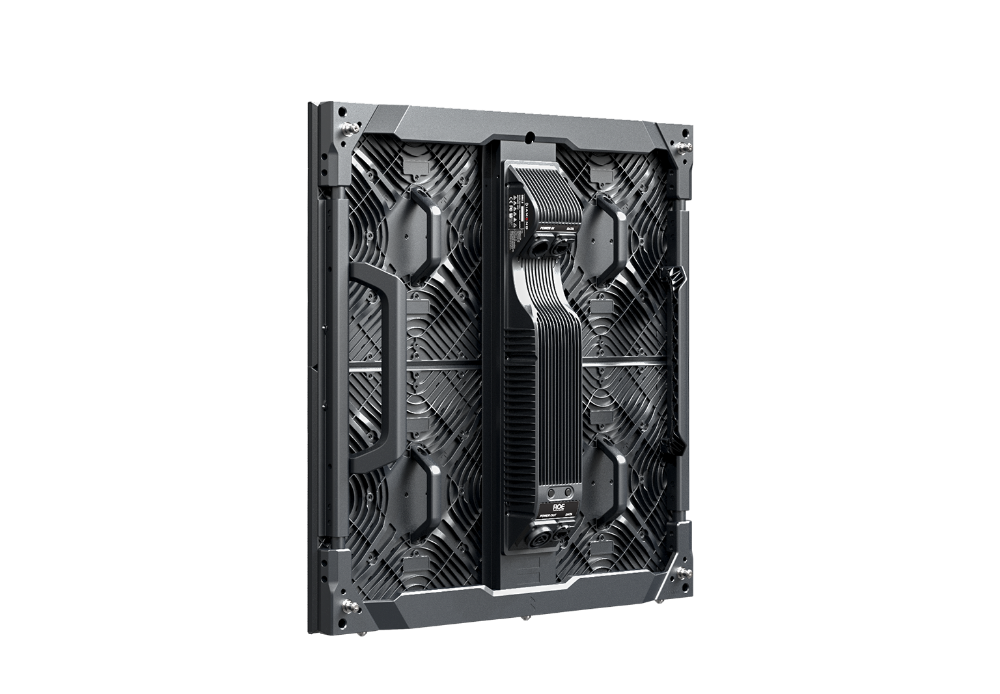

# Roe Visual Diamond Display Panel

> Links: [Diamond Product Page](https://www.roevisual.com/en/products/diamond)

## Panel Specs

| Name    | Cabinet Resolution | Pixel Pitch | Cabinet Size (Width x Height x Depth) | Refresh Rate | Brightness | Average Power |
|---------|--------------------|-------------|---------------------------------------|--------------|------------|---------------|
| DM2.6   | 192 x 192 px       | 2.6 mm      | 500 mm x 500 mm x 80 mm               | 3840 Hz      | 1500 nits  | 90 Watts      |
| DM3.9   | 128 x 128 px       | 3.9 mm      | 500 mm x 500 mm x 80 mm               | 3840 Hz      | 1500 nits  | 80 Watts      |

