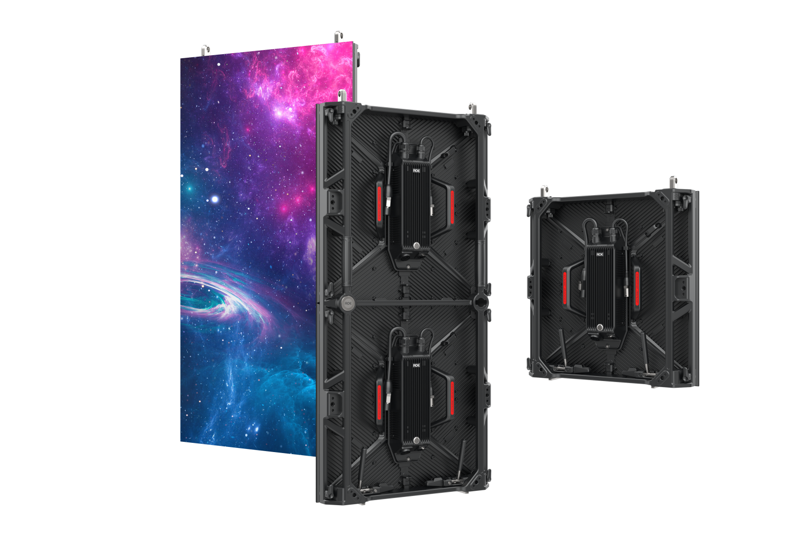

# Roe Visual Obsidian Display Panel

> Links: [Obsidian Product Page](https://www.roevisual.com/en/obsidian)

## Panel Specs

| Name    | Cabinet Resolution | Pixel Pitch | Cabinet Size (Width x Height x Depth) | Refresh Rate | Brightness | Average Power |
|---------|--------------------|-------------|---------------------------------------|--------------|------------|---------------|
| OB2.6   | 192 x 192 px       | 2.6 mm      | 500 mm x 500 mm x 74.6 mm             | 7680 Hz      | 2500 nits  | 110 Watts     |

