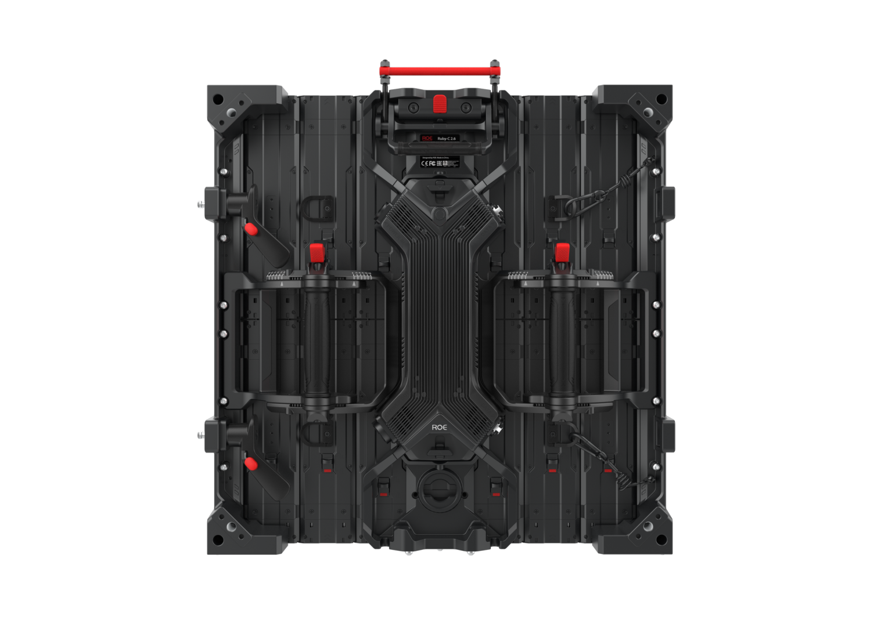

# Roe Visual Ruby-C Display Panel

> Links: [Ruby-C Product Page](https://www.roevisual.com/en/products/ruby-c)

## Panel Specs

| Name         | Cabinet Resolution | Pixel Pitch | Cabinet Size (Width x Height x Depth) | Refresh Rate | Brightness | Average Power |
|--------------|--------------------|-------------|---------------------------------------|--------------|------------|---------------|
| RB-C1.9BV2   | 256 x 256 px       | 1.95 mm      | 500 mm x 500 mm x 108 mm            | 7680 Hz      | 1500 nits  | 80 Watts      |

