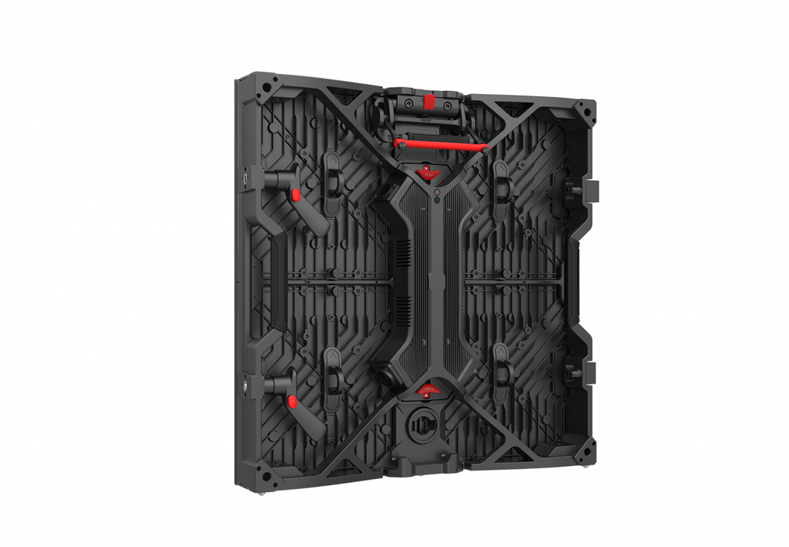

# Roe Visual Ruby Display Panel

> Links: [Ruby Product Page](https://www.roevisual.com/en/products/ruby)

## Panel Specs

| Name    | Cabinet Resolution | Pixel Pitch | Cabinet Size (Width x Height x Depth) | Refresh Rate | Brightness | Average Power |
|---------|--------------------|-------------|---------------------------------------|--------------|------------|---------------|
| RB1.2   | 400 x 400 px       |1.25 mm      | 500 mm x 500 mm x 73mm                | 7680 Hz      | 800 nits   | 105 Watts     |

