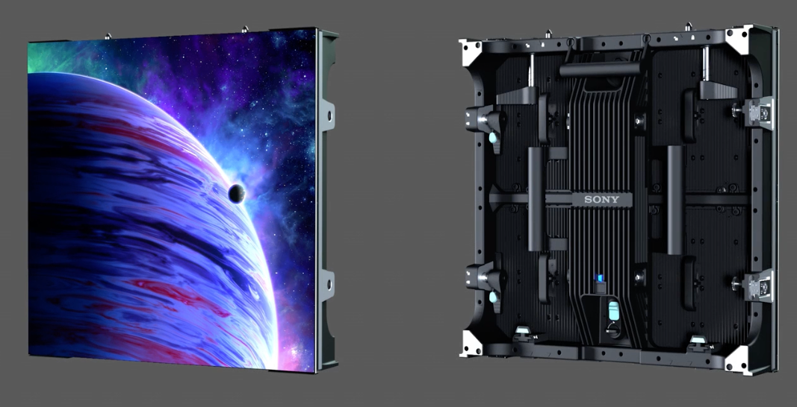

# Sony Verona Crystal Display Panel

> Links: [Verona Product Page](https://pro.sony/ue_US/products/led-video-walls/verona) | [PDF Guide](https://pro.sony/s3/2023/08/17083135/Crystal_LED_VERONA_Brochure_Nov2023.pdf) | [Sony Virtual Production Solutions](https://pro.sony/ue_US/cinematography/virtual-production)

## Panel Specs

### Brompton Model

| Name              | Cabinet Resolution | Pixel Pitch | Cabinet Size (Width x Height x Depth) | Refresh Rate | Brightness      | Average Power | Mass    |
|-------------------|--------------------|-------------|---------------------------------------|--------------|-----------------|---------------|---------|
| ZRD-VP15EB P1.56  |  320 x 320 px      |  1.56 mm    | 500 mm x 500 mm x 93 mm               |  7680 Hz     | 1500 cd/m&sup2; | 108 Watts     | 10.1 kg |
| ZRD-VP23EB P2.31  |  216 x 216 px      |  2.31 mm    | 500 mm x 500 mm x 93 mm               |  7680 Hz     | 1500 cd/m&sup2; | 114 Watts     | 10.1 kg |

### Megapixel Model

| Name              | Cabinet Resolution | Pixel Pitch | Cabinet Size (Width x Height x Depth) | Refresh Rate | Brightness      | Average Power | Mass    |
|-------------------|--------------------|-------------|---------------------------------------|--------------|-----------------|---------------|---------|
| ZRD-VP15EM P1.56  |  320 x 320 px      |  1.56 mm    | 500 mm x 500 mm x 93 mm               |  7680 Hz     | 1500 cd/m&sup2; | 119 Watts     | 10.1 kg |
| ZRD-VP23EM P2.31  |  216 x 216 px      |  2.31 mm    | 500 mm x 500 mm x 93 mm               |  7680 Hz     | 1500 cd/m&sup2; | 125 Watts     | 10.1 kg |

